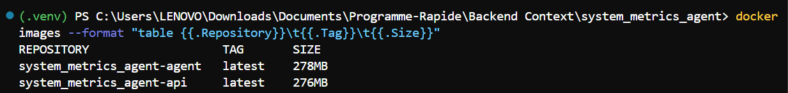
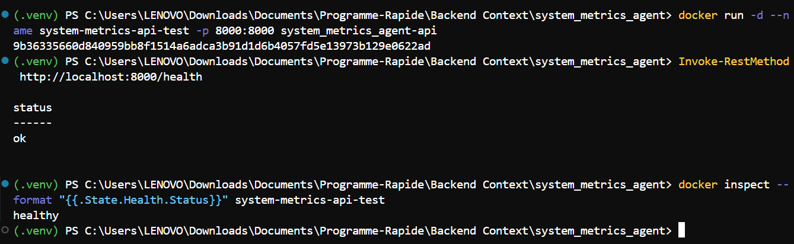
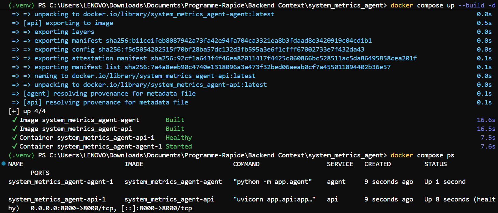
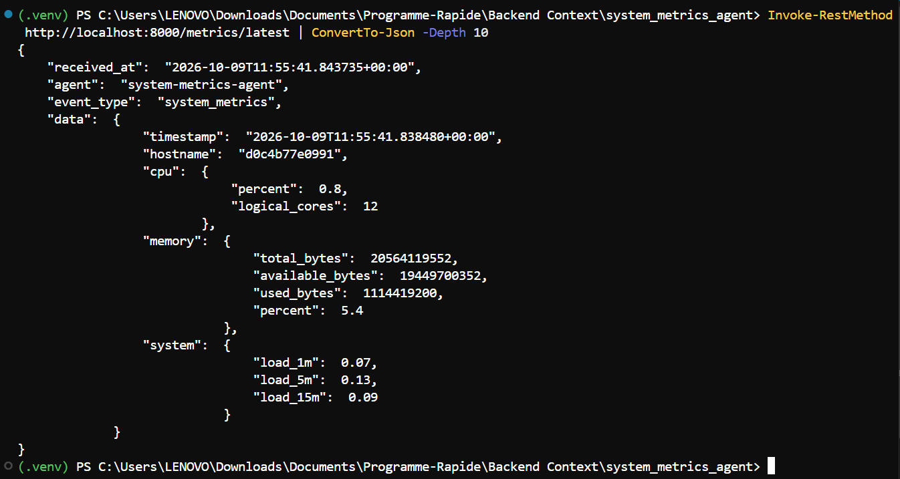

# Rapport de réalisation — TP DevOps INGC2

**Sujet :** Conteneurisation et automatisation du déploiement de `system_metrics_agent`
**Étudiant(s) :** `[DANSOU Koffi Junior]`
**Dépôt GitHub :** `[https://github.com/Thrylos77/system_metrics_agent.git]`
**Dépôts Docker Hub :** `[URL de l'image API]` · `[URL de l'image agent]`
**Date de validation :** `[10/10/2026]`

> **À finaliser après les essais :** remplacer les champs entre crochets par les résultats réels. Ne pas déclarer une étape comme réussie avant d'avoir vérifié sa sortie. Les captures indiquées ci-dessous sont celles qui apportent une preuve utile ; le fork, les fichiers, les branches, les commits et les secrets peuvent être vérifiés directement sur GitHub, donc aucune capture n'est nécessaire pour ces éléments.

## 1. Objectif et chaîne réalisée

Le projet initial comprend une API FastAPI qui reçoit les métriques et un agent Python qui collecte CPU, mémoire et charge système avant de les transmettre à l'API. L'objectif du TP est de produire deux images de production, de les exécuter ensemble avec Docker Compose puis de contrôler automatiquement le code et les images avant toute publication.

**Chaîne cible :**

`GitHub → tests Pytest + couverture → SonarQube + Quality Gate → build Docker → scan Trivy → Docker Hub`

Le dépôt de travail est issu du fork du dépôt fourni par l'enseignant. Les modifications DevOps sont regroupées sur la branche `feature/devops` avant leur intégration dans `main`.

## 2. Prise en main et tests

Les tests du projet se trouvent dans `app/tests/`. La documentation initiale mentionnait un dossier `tests/`; l'emplacement réel a donc été vérifié avant de configurer le pipeline.

Commandes de validation utilisées :

```powershell
pytest -q
pytest -q --cov=app --cov-report=term-missing --cov-report=xml:coverage.xml
```

**Résultat local :** `[nombre de tests réussis : 6 /échoués : 2 ]` ·
**Couverture :** `[pourcentage observé : 56%]`.

Le fichier `coverage.xml` est ensuite lu par SonarQube via `sonar.python.coverage.reportPaths=coverage.xml`. Le résultat faisant foi pour la livraison est également visible dans le journal du job `test` de GitHub Actions.

## 3. Conteneurisation de production

Deux fichiers distincts sont utilisés : `Dockerfile.api` pour FastAPI et `Dockerfile.agent` pour le collecteur.

| Choix technique                                           | Justification                                                                                                                                             |
| --------------------------------------------------------- | --------------------------------------------------------------------------------------------------------------------------------------------------------- |
| `python:3.12-slim-bookworm`                             | Base relativement légère, version et distribution explicites ; le tag`latest` n'est pas utilisé.                                                     |
| Build multi-stage (`builder` puis `runtime`)          | Les dépendances sont installées dans l'étape de construction ; l'image finale ne reçoit que l'environnement Python nécessaire et le code applicatif. |
| `requirements.txt` séparé de `requirements-dev.txt` | Les outils de tests et de développement ne sont pas installés dans les images de production.                                                            |
| Utilisateur`app` non-root                               | Réduit les privilèges du processus dans le conteneur.                                                                                                   |
| `.dockerignore`                                         | Exclut notamment`.git`, les environnements virtuels, les caches, les fichiers `.env` et les résultats de tests du contexte de build.                 |
| `HEALTHCHECK` et `EXPOSE 8000` sur l'API              | Permet de contrôler`/health` et documente le port utilisé par l'API.                                                                                  |
| Uvicorn sans`--reload`                                  | Le rechargement automatique est réservé au développement, pas à l'image de production.                                                                |
| `procps` dans l'image agent                             | Fournit la commande`uptime` utilisée par le collecteur via `subprocess`.                                                                             |

### Build et taille des images

```powershell
docker build -f Dockerfile.api -t system_metrics_agent-agent .
docker build -f Dockerfile.agent -t system_metrics_agent-api .
docker images --format "table {{.Repository}}\t{{.Tag}}\t{{.Size}}"
```

| Image                          | Taille observée après build |
| ------------------------------ | ----------------------------: |
| `system_metrics_agent-agent` |                  `[278 MB]` |
| `system_metrics_agent-api`   |                  `[276 MB]` |

> **CAPTURE 1 —** sortie de `docker images` montrant les deux images et leurs tailles.
> 

### Vérification de l'API seule

```powershell
docker run -d --name system-metrics-api-test -p 8000:8000 system_metrics_agent-api
Invoke-RestMethod http://localhost:8000/health
docker inspect --format "{{.State.Health.Status}}" system-metrics-api-test
```

Résultat attendu : `/health` répond avec `status: ok` et le statut du conteneur devient `healthy`. Après le test :

```powershell
docker rm -f system-metrics-api-test
```

**Résultat observé :** `[HTTP 200 / contenu obtenu / statut de santé]`.

> **CAPTURE 2 —** commande `docker run`, résultat de `/health` et statut `healthy`.
> 

## 4. Exécution locale avec Docker Compose

Le fichier `docker-compose.yml` démarre les services `api` et `agent`. La configuration est injectée au démarrage depuis `.env`, qui est ignoré par Git. Le modèle `.env.example` est versionné afin de documenter les variables sans exposer de configuration locale sensible.

Pour démarrer et vérifier l'ensemble :

```powershell
Copy-Item .env.example .env
docker compose config
docker compose up --build -d
docker compose ps
Start-Sleep -Seconds 6
Invoke-RestMethod http://localhost:8000/health
Invoke-RestMethod http://localhost:8000/metrics/latest | ConvertTo-Json -Depth 10
docker compose logs --tail 30 agent
```

Dans Compose, l'agent appelle `http://api:8000/metrics` :

 `api` est le nom du service sur le réseau Compose. `127.0.0.1` dans le conteneur agent désignerait le conteneur agent lui-même, pas le conteneur API. La condition `depends_on: condition: service_healthy` retarde le démarrage de l'agent jusqu'à ce que le contrôle de santé de l'API réussisse. Les deux services utilisent `restart: unless-stopped`.

**Résultat observé :** `/health` → `[résultat]` ; `/metrics/latest` → `[métrique réellement reçue ou difficulté constatée]` ; état Compose → `[healthy / running]`.

> **CAPTURE 3 & 4 —** : `docker compose ps` avec l'API saine et le résultat de `/metrics/latest` montrant une métrique envoyée par l'agent conteneurisé.
>
> 
>
> 

### Limite de mesure en conteneur

Dans un conteneur, l'agent observe l'environnement de ressources qui lui est présenté par le runtime (notamment les limites et l'isolation du conteneur), et non nécessairement la consommation globale de la machine hôte. `uptime` reflète également l'environnement Linux du conteneur/runtime, qui peut être différent de l'hôte Windows. Pour surveiller fidèlement l'hôte dans un déploiement réel, il faut prévoir une collecte dédiée sur l'hôte ou un exporteur adapté.

## 5. SonarQube et Quality Gate

Le fichier `sonar-project.properties` configure la clé `system-metrics-agent`, les sources `app`, les tests `app/tests` et l'import de `coverage.xml`. Dans le job `test`, GitHub Actions exécute Pytest avec couverture, soumet l'analyse à SonarQube puis attend le résultat du Quality Gate.

Le pipeline est configuré pour que le job `build-scan-push` dépende du succès du job `test`. Un Quality Gate non validé doit donc empêcher le passage à la construction et à la publication des images.

**Serveur utilisé :** `[Serveur SonarQube local Docker]`**Projet SonarQube :** `[http://localhost:9000]`**Résultat du Quality Gate :** `[PASSED / FAILED — à renseigner après exécution]`.

> **CAPTURE 5 — `docs/captures/04-sonarqube-quality-gate.png`** : tableau de bord du projet affichant le résultat de l'analyse et le Quality Gate. Masquer toute information sensible. La réussite du contrôle est aussi consultable dans les logs GitHub Actions.

**Attention :** un SonarQube accessible seulement via `http://localhost:9000` sur le PC de développement n'est pas accessible depuis un runner GitHub hébergé. Pour le pipeline distant, l'URL définie par `SONAR_HOST_URL` doit être accessible depuis GitHub Actions. L'instance locale Compose est un bonus pour les analyses locales, sauf si elle est rendue accessible de façon sécurisée depuis le runner.

## 6. Pipeline GitHub Actions, Trivy et Docker Hub

Le workflow est défini dans `.github/workflows/ci-cd.yml`. Il est déclenché par un `push` sur `main` et par une Pull Request ciblant `main`.

- **Job `test`** : checkout complet (`fetch-depth: 0`), configuration Python, installation des dépendances de développement, tests avec couverture XML, analyse SonarQube et contrôle du Quality Gate.
- **Job `build-scan-push`** : dépend du job `test`, construit séparément l'image API et l'image agent, scanne chaque image avec Trivy, publie les rapports SARIF lorsque disponibles, puis pousse les images uniquement lors d'un `push` sur `main`.
- **Politique Trivy** : sévérités `HIGH,CRITICAL`, `ignore-unfixed: true` et `exit-code: 1`. Les vulnérabilités de ces niveaux pour lesquelles aucun correctif n'est disponible sont ignorées par ce contrôle ; une détection correspondante corrigible fait échouer l'étape.
- **Tags Docker Hub** : pour chaque image, le workflow publie le SHA du commit et `latest`. Les Pull Requests ne doivent pas publier d'image sur Docker Hub.

### Secrets configurés

Les secrets doivent exister dans **Settings → Secrets and variables → Actions** : `DOCKERHUB_USERNAME`, `DOCKERHUB_TOKEN`, `SONAR_TOKEN`, `SONAR_HOST_URL`. `DOCKERHUB_TOKEN` est un Access Token Docker Hub, pas le mot de passe du compte. Aucun secret ne doit être écrit dans le code, le fichier `.env.example`, un Dockerfile, le README ou les journaux de capture.

### Liens des résultats

- **Dépôt GitHub :** `[https://github.com/Thrylos77/system_metrics_agent.git]`
- **Exécution verte du workflow :** `[URL de l'exécution réussie sur GitHub Actions]`
- **Exécution rouge volontaire :** `[URL de l'exécution échouée sur GitHub Actions]`
- **Image API sur Docker Hub :** `[URL de la page Docker Hub]`
- **Image agent sur Docker Hub :** `[URL de la page Docker Hub]`

> **CAPTURE 5 À AJOUTER — `docs/captures/05-pipeline-verte.png`** : exécution GitHub Actions réussie montrant les jobs et les contrôles validés. Le lien direct de l'exécution doit également être renseigné ci-dessus.

## 7. Démonstration volontairement rouge

La démonstration consiste à rendre temporairement fausse une assertion de test sur une branche distincte, par exemple `demo/failure`, puis à ouvrir une Pull Request vers `main`. Le test doit échouer ; grâce à `needs: test`, le job `build-scan-push` doit être bloqué/skippé. Cette branche de démonstration n'est pas à fusionner avec le test cassé.

Après la capture, restaurer l'assertion, pousser la correction, puis fermer ou mettre à jour la Pull Request de démonstration afin de ne pas laisser une modification volontairement défectueuse en attente.

> **CAPTURE 6 À AJOUTER — `docs/captures/06-pipeline-rouge.png`** : échec du job `test` et job `build-scan-push` bloqué ou ignoré. Cette preuve est demandée dans le TP.

## 8. Bonus mis en place

| Bonus du sujet                               | Implémentation / preuve                                                                                                                                   |
| -------------------------------------------- | ---------------------------------------------------------------------------------------------------------------------------------------------------------- |
| Cache des couches Docker dans GitHub Actions | `cache-from` et `cache-to` avec backend `type=gha`, avec un scope séparé pour l'API et l'agent. Vérifiable dans le workflow et les logs de build. |
| SonarQube local                              | `docker-compose.sonar.yml` lance SonarQube Community Build et PostgreSQL avec volumes persistants. Voir les commandes dans le guide d'implémentation.   |
| Trivy au format SARIF                        | Les rapports`trivy-api.sarif` et `trivy-agent.sarif` sont envoyés à GitHub Code Scanning quand ils sont générés.                                  |
| Dependabot                                   | `.github/dependabot.yml` contrôle chaque semaine les dépendances `pip` et les actions GitHub.                                                        |

> **CAPTURE 7 OPTIONNELLE — `docs/captures/07-github-security-sarif.png`** : onglet Security / Code scanning montrant les résultats Trivy importés. Ne prendre cette capture qu'après avoir activé/configuré la fonctionnalité et vérifié que le rapport est bien visible.

## 9. Bilan technique et difficultés

Les choix principaux visent à limiter la taille des images, réduire les privilèges des processus, ne pas intégrer les secrets dans les images, attendre la disponibilité de l'API et bloquer la publication en cas d'échec des tests, du Quality Gate ou du scan de sécurité.

**Difficultés rencontrées et solutions apportées :** `[à compléter avec les difficultés réellement rencontrées : build, réseau Compose, SonarQube, vulnérabilités Trivy, secrets ou permissions GitHub]`.

**État final :**

- [X] Les tests locaux passent et la couverture XML est générée.
- [X] Les deux images sont construites ; leurs tailles sont consignées ci-dessus.
- [X] L'API répond à `/health` et son healthcheck passe.
- [X] Compose démarre les deux services et `/metrics/latest` renvoie une métrique de l'agent.
- [X] Le Quality Gate a été évalué par le serveur SonarQube retenu.
- [X] Une exécution verte et une exécution rouge volontaire sont accessibles sur GitHub Actions.
- [X] Les deux images sont publiées sur Docker Hub avec les tags SHA et `latest` après validation sur `main`.
- [X] Les secrets sont configurés sans être exposés dans le dépôt.
- [X] Les bonus revendiqués ont été exécutés et vérifiés, pas seulement ajoutés sous forme de fichiers.

## 10. Captures nécessaires et non nécessaires

| Élément                             | Capture ?                  | Pourquoi                                                                                                                 |
| ------------------------------------- | -------------------------- | ------------------------------------------------------------------------------------------------------------------------ |
| Fork et branche de travail            | Non                        | Le fork, les branches et l'historique se vérifient directement sur GitHub.                                              |
| Présence des fichiers livrables      | Non                        | Ils sont visibles dans le dépôt.                                                                                       |
| Secrets GitHub                        | **Non**              | Ne jamais exposer les valeurs des secrets. Leur présence se vérifie dans les paramètres, sans révéler leur contenu. |
| Tailles des images Docker             | **Oui**              | Une sortie terminal prouve la taille des deux images locales.                                                            |
| Test`docker run` et `/health`     | **Oui**              | Demandé explicitement par le sujet.                                                                                     |
| Compose +`/metrics/latest`          | **Oui, recommandé** | Prouve l'intégration effective de l'agent et de l'API.                                                                  |
| Pipeline verte                        | **Oui**              | Livrable demandé ; ajouter aussi le lien vers l'exécution.                                                             |
| Pipeline rouge volontaire             | **Oui**              | Livrable demandé pour montrer le blocage du job suivant.                                                                |
| Tableau de bord SonarQube             | Recommandée               | Rend le résultat du Quality Gate facile à lire ; les logs CI restent consultables.                                     |
| Résultats SARIF dans GitHub Security | Optionnelle                | Preuve visuelle du bonus Trivy/SARIF.                                                                                    |

**Organisation conseillée des images :** créer `docs/captures/` dans le dépôt et y placer les fichiers `01-tailles-images.png`, `02-test-api-docker-run.png`, `03-compose-metrics.png`, `04-sonarqube-quality-gate.png`, `05-pipeline-verte.png`, `06-pipeline-rouge.png` et, si le bonus a été vérifié, `07-github-security-sarif.png`.
